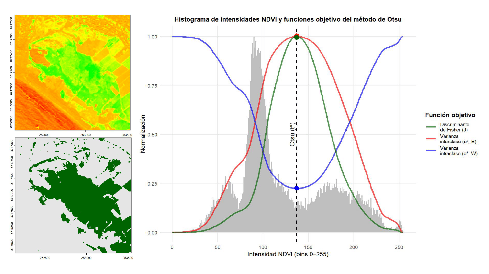

# Umbralización de Otsu (Otsu's thresholding)

     

**Autor**: Renzo Angel De La Cruz Gonzales

---

## Introducción

La segmentación de imágenes constituye una etapa fundamental en la visión por computadora, ya que permite transformar información continua en clases discretas con significado temático. En el ámbito de la teledetección (remote sensing), esta tarea adquiere especial relevancia, pues facilita la delimitación de coberturas terrestres como vegetación, cuerpos de agua o áreas antrópicas a partir de imágenes satelitales. En este sentido, la elección del umbral de separación suele ser determinante para la calidad del resultado. No obstante, la selección del umbral puede introducir subjetividad cuando se basa únicamente en valores reportados en la bibliografía o en criterios visuales, ya que dichos valores no son necesariamente transferibles entre sensores, resoluciones espaciales, condiciones atmosféricas o características propias de cada escena.

En este contexto, el método de umbralización de Otsu (Otsu’s thresholding) ofrece una alternativa estadística, reproducible y basada en datos para estimar automáticamente un umbral óptimo a partir de la distribución de intensidades de la imagen. Propuesto por Nobuyuki Otsu (1979), este método se fundamenta en maximizar la separación entre dos clases mediante la optimización de la varianza interclase, lo que permite obtener una segmentación binaria robusta bajo un marco probabilístico.

El objetivo de este proyecto es desarrollar el método de Otsu aplicado a un raster NDVI derivado de imágenes satelitales CBERS-4A sobre el Humedal de Santa Rosa. Para ello, se elaboro un flujo de trabajo que incluye la preparación de los datos, la discretización del índice en niveles de intensidad, el cálculo del umbral óptimo mediante una función implementada manualmente y la comparación de resultados con un método estándar (paquete *EBImage*). Finalmente, se presenta la segmentación binaria obtenida y se discuten aspectos prácticos como la influencia del rango de reescalamiento, las diferencias numéricas entre implementaciones y las limitaciones del método en escenarios donde el histograma no es aproximadamente bimodal.

---

📌 **Objetivos del análisis**

- Preparar los datos satelitales mediante corrección radiométrica, pan-sharpening y cálculo del NDVI.
- Discretizar el NDVI en niveles de intensidad y analizar su distribución mediante histogramas.
- Implementar el método de Otsu de forma manual para determinar el umbral óptimo.
- Evaluar la influencia del rango de reescalamiento (mín–máx de la escena vs rango teórico [−1, 1]) en el cálculo del umbral.
- Analizar la equivalencia entre los criterios de maximización de la varianza interclase, minimización de la varianza intraclase y el criterio discriminante de Fisher.

---

🧪 **Archivo principal**

📓 R Markdown:
- [CASO_APLICADO_Analisis_Umbralizacion_Otsu.Rmd](https://rpubs.com/delacruz-renzo/otsu-thresholding-ndvi)

---

📦 **Instalación / Uso**

Las funciones pueden utilizarse directamente desde este repositorio sin necesidad de descargar los archivos localmente:

```r
source("https://raw.githubusercontent.com/delacruz-renzo/otsu-thresholding/main/R/otsu_threshold_raster.R")
```

---

📊 **Gráfico generado**  

La figura presentada compara el histograma de intensidades NDVI discretizadas y funciones objetivo del método de Otsu. El umbral óptimo 𝑡∗ coincide con el máximo de σ²_B y del criterio de Fisher, y con el mínimo de σ²_W, mostrando la equivalencia entre los criterios de optimización.

<div style="text-align: center;">
  
</div>

---

💬 **Notas adicionales**

- Proyecto orientado a teledetección y segmentación de imágenes, con implementación paso a paso del método de Otsu aplicado a NDVI.
- Se incluye una implementación manual del algoritmo y una comparación con *EBImage* para validar resultados.


📚 **Desarrollado por Renzo De La Cruz | Remote Sensing & GIS**

🔗 Sígueme en mis Redes Sociales: [linktr.ee/renzo-delacruz](https://www.linkedin.com/in/renzo-delacruz/)

---
